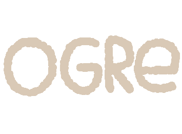
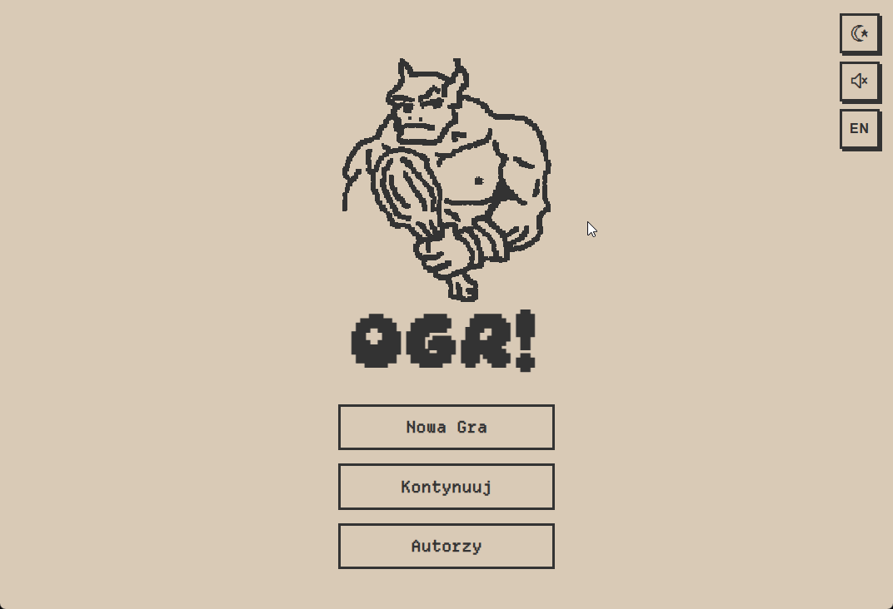

# Ogre! — Interactive Gamebook

<p align="center">
	
</p>

<p align="center">
	
	
	
	
	
</p>

Pixel-art, bilingual (PL/EN) interactive gamebook built with React + Vite.
You race through a dangerous forest to bring a healing potion home, while every decision changes your route and ending.

Live demo: https://ogr-two.vercel.app

---

## Polski

Dwujęzyczna (PL/EN) gra paragrafowa w klimacie pixel-art.
Prowadzisz bohatera przez las, by zdążyć z miksturą uzdrawiającą dla chorej siostry, a na drodze staje ogr.

### Najważniejsze funkcje

- Ponad 160 paragrafów i wiele zakończeń
- Przełącznik języka PL/EN z obsługą i18next
- Motyw jasny/ciemny, zapis preferencji i obsługa osadzenia (embed)
- Muzyka tła z możliwością wyciszenia
- Własny parser markdown i silnik historii
- Dbałość o dostępność: focus-visible, większe cele dotykowe, prefers-reduced-motion

### Uruchomienie lokalne

```bash
npm install
npm run dev
```

### Build produkcyjny

```bash
npm run build
npm run preview
```

---

## English

A bilingual (PL/EN) pixel-art interactive gamebook.
You guide the protagonist through a hostile forest to save their sister, while choices affect pacing, inventory, and ending paths.

### Key features

- 160+ paragraphs with branching outcomes
- PL/EN language toggle powered by i18next
- Light/dark themes with persisted preferences and embed support
- Background music with mute control
- Custom markdown parser and story engine
- Accessibility-minded UI: focus-visible, touch targets, prefers-reduced-motion

### Local setup

```bash
npm install
npm run dev
```

### Production build

```bash
npm run build
npm run preview
```

---

## Demo

<p align="center">
	
</p>

---

## Stack

React 19, Vite, i18next, react-i18next, Howler.js

---

## Project structure

```text
.
|- public/
|  |- audio/
|  |- favicon/
|  |- fonts/
|  |- demo.gif
|  `- logo.gif
|- src/
|  |- assets/
|  |- audio/
|  |- components/
|  |- content/
|  |- engine/
|  |- utils/
|  |- App.jsx
|  |- i18n.js
|  |- main.jsx
|  `- styles.css
|- index.html
|- package.json
|- README.md
`- vite.config.js
```

---

## Credits and asset licenses

### Icons

- Pixel Icon Library — created by HackerNoon. Licensed under CC BY 4.0.

### Text and story

- Suddenly an Ogre — interactive gamebook by TroyPress (J. Alan Henning). Licensed under CC BY-SA 4.0.

### Fonts

- Departure Mono — designed by Helena Zhang. Licensed under SIL Open Font License 1.1.
- Daydream Demo — created by DoubleGum. Used under the creator's individual license terms.

### Music

- Farewell My Friend — composed by One Man Symphony. Licensed under CC BY 4.0.
- Orchestral Battle Music — composed by Johan Jansen (Zefz). Used under CC BY-SA 3.0.
- Creepy Forest (F) — created by Augmentality (Brandon Morris), published on OpenGameArt by HaelDB. Released under CC0 1.0.
- Haunted Woods (Horror Drone) — composed by Michael Klier. Licensed under CC BY-SA 3.0.
- Dark Ambiance — Cries From Hell — composed by Jesus Lastra (jalastram). Licensed under CC BY 3.0.
